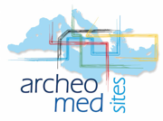

## a wholly different archaeological information system
 
 
 

*2015/01/19:* **check back later…**  
*2016/03/01:* **almost ready for the first release**
 
 
 
 
 
 
 
****
oa2 is being developed within the projects:
 
 

 
PRIN 2010-2011. *Global archaeology and history of the rural landscapes of Italy between Late Antiquity and the Middle Ages. Integrated systems of sources, methods and techniques for a sustainable development* 
Research Unit: University of Siena (Italy). Department of Historical Sciences and Cultural Heritage 
RU coordinator: Prof. M. Valenti 
RU project title: *Archaeology of Tuscan landscapes between Late Antiquity and the Middle Ages. Research, applications and web 2.0* 
 
 

 
ENPI CBCMED – Mediterranean Sea Basin Programme 2007-2013 
*ARCHEOMEDSITES. Safeguard, valorisation and management quality. Use of the management models for the archeological sites and urban contexts*
 
Work-package 4.10 (Municipality of Siena in collaboration with the Department of Historical Sciences and Cultural Heritage of the University of Siena): *Providing an archeological Geographic Information System to the 3 Countries involved and supplying the necessary training for its functioning*
 

****
 
 

  Made with Wakanda (www.wakanda.org)
