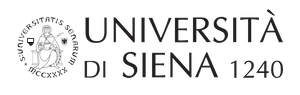

## a wholly different archaeological information system ##

----------
 
######OpenArcheo2 is being developed within the projects:
 
 

 
######PRIN 2010-2011. *Global archaeology and history of the rural landscapes of Italy between Late Antiquity and the Middle Ages. Integrated systems of sources, methods and techniques for a sustainable development*
*Research Unit*: University of Siena (Italy). Department of Historical Sciences and Cultural Heritage 
*RU coordinator*: Prof. M. Valenti 
*RU project title*: *Archaeology of Tuscan landscapes between Late Antiquity and the Middle Ages. Research, applications and web 2.0* 
 
 

 
######ENPI CBCMED. Mediterranean Sea Basin Programme 2007-2013 
######*ARCHEOMEDSITES. Safeguard, valorisation and management quality. Use of the management models for the archeological sites and urban contexts*
 
Work-package 4.10 (Municipality of Siena in collaboration with the Department of Historical Sciences and Cultural Heritage of the University of Siena): *Providing an archeological Geographic Information System to the 3 Countries involved and supplying the necessary training for its functioning*
 
****
 
 

  *openarcheo2* is made with [Wakanda Community Edition](www.wakanda.org "Wakanda") and  is released under [MIT license](http://www.opensource.org/licenses/MIT "MIT license")  
 
 
 
 

 
[CC-BY-SA](http://creativecommons.org/licenses/by-sa/4.0/ "CC-BY-SA") [LIAAM-UNISI (Laboratory of IT Applied to Medieval Arcaheology, University of Siena)](http://archeologiamedievale.unisi.it "LIAAM-UNISI"), 2016
